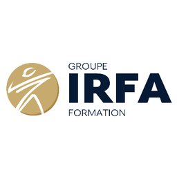

# Projet HTML 1

## Description
Bienvenue dans notre projet. Voici le site web associé pour plus d'informations.

[Visitez le site web](https://formationdevprojet.ovh)
[https://formationdevprojet.ovh]
### Projet HTML 1 est un projet de développement web , réalisé dans le cadre de la formation IRFA. Ce projet est un entraînement à la méthode Agile, avec un sprint dédié au développement d'une page HTML utilisant Bootstrap.

## Fonctionnalités
- Création d'une page HTML avec Bootstrap
- Utilisation des composants Bootstrap
- Implémentation de styles personnalisés
- Utilisation de Visual Studio Code (VS Code) IDE
- Utilisation de Microsoft Visual Studio 2022
## Autheurs
- Cathy
- Fred
- Mickael
- Lucas
  
## Installation

Instructions pour installer et exécuter le projet localement.

```bash
git clone https://github.com/utilisateur/projet-html-1.git
cd projet-html-1
